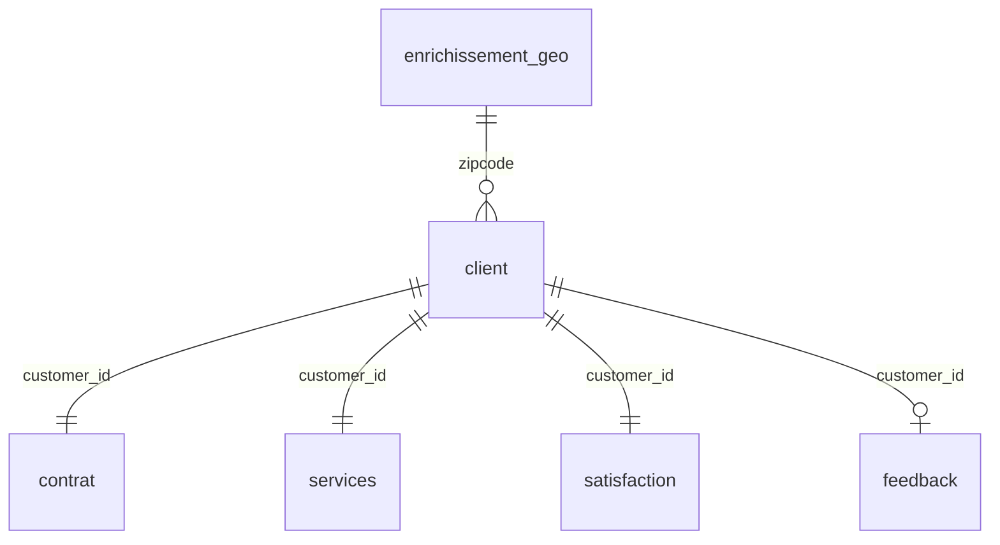

# Modèle physique de données (MPD) — PostgreSQL

Traduction physique des data contracts v0.2, organisée selon les couches du HLD.

| Fichier | Contenu |
|---|---|
| `ddl/01_schemas.sql` | Schémas `raw`, `staging`, `core`, `mart` |
| `ddl/02_raw.sql` | Une table par fichier source, colonnes `TEXT`, valeurs conservées telles quelles |
| `ddl/03_core.sql` | Modèle de référence typé : clés, domaines, bornes et règles de cohérence des contrats |

Les schémas `staging` et `mart` sont alimentés par dbt (P4 / P5).

## Couche CORE



| Table | Clé primaire | Source RAW | Contrat |
|---|---|---|---|
| `core.enrichissement_geo` | `zipcode` | `raw.census_zcta` | enrichissement_geo (TBD v0.2) |
| `core.client` | `customer_id` | `raw.telco` | client v0.1.0 |
| `core.contrat` | `customer_id` | `raw.telco` | contrat v0.2.0 |
| `core.services` | `customer_id` | `raw.telco` | services |
| `core.satisfaction` | `customer_id` | `raw.telco_satisfaction` | satisfaction |
| `core.feedback` | `customer_id` | `raw.telco_noisy_feedback` | feedback v0.2.0 |

**Choix de modélisation**
- Colonnes en `snake_case` (`customerID` → `customer_id`).
- Champs `Yes/No` et `0/1` typés `BOOLEAN`.
- Contraintes nommées `ck_<table>_<règle>` / `fk_<table>_<cible>` : chaque rejet est rattaché à une règle du contrat.
- Deux règles marquées « proposition v0.3 » dans `03_core.sql`, à valider dans les contrats :
  - domaine de `motif_contact_principal` complété (8 valeurs observées, 5 déclarées en v0.2) ;
  - `feedback_length` et `sentiment` à `NULL` lorsque `has_feedback = false`.

## Lancer la base et contrôler les données

```bash
cp .env.example .env              # renseigner POSTGRES_PASSWORD
docker compose up -d              # PostgreSQL 16, DDL appliqué au premier démarrage
poetry run python scripts/check_mpd_conformance.py                  # données RAW telles quelles
poetry run python scripts/check_mpd_conformance.py --staging-rules  # avec les règles STAGING proposées
```

Le script charge les sources dans `raw`, insère chaque ligne dans `core` et rattache chaque rejet à la contrainte violée. Il vide les tables `raw.*` et `core.*` : à lancer uniquement sur une base de développement.

Prérequis : `data/raw/` extrait de `data-enrichi.zip` et `data/processed/census_zcta_2022.csv` produit par le notebook 3.0.

**Résultat de référence (01/10/2026)**

| Table CORE | Lignes | Rejets (RAW tel quel) | Rejets (règles STAGING) |
|---|---|---|---|
| `enrichissement_geo` | 15 | 0 | 0 |
| `client` | 7 043 | 0 | 0 |
| `contrat` | 7 043 | 11 · `total_charges` vide (tenure = 0) | 0 |
| `services` | 7 043 | 0 | 0 |
| `satisfaction` | 7 043 | 0 | 0 |
| `feedback` | 7 032 | 7 032 · `customer_id` en minuscules, puis 5 274 · score sans verbatim | 0 |
